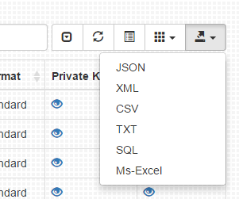

## Introducing the Newest addition to the Ribbit family of software. 
#### New Multi-coin Wallet software, p2p, Multisig, ability to run serverless. Open the html file or desktop bundle and start managing your Crypto accounts.

<table>
    <tr>
        <td>
			
		</td>
		<td>
			**Throughout the development** of our yet to be named wallet, we borrow concepts and improve upon designs such as Copay and other popular wallets. One of the features that has proven both convenient and a major pain is the option to store data on the user's browser. This is commonly known as browser storage or localstorage. One of the lessons learned from using the Copay wallet was that not everyone understans the implications of utilizing localstorage.
			  
			Local browser storage is **erased when a user chooses to clear their browser cache / history** and the most common problem we noticed was **Incognito and Private Browsing** mode does not save the localstorage once you close your browser. 
			  
			On the other hand. Local browserstorage has some amazing uses as well. The main being that its use removes the need to store any sensitive information on someone elses servers. 
		</td>
    </tr>
</table>

<table>
    <tr>
        <td>
			**Keeping in mind problems** users have had with previous wallets we decided to focus on ways to mitigate the loss of data. 
			 
			One of those is having a browser instance dedicated to only the wallet. 
			  We are utilizing the [Electron](http://electron.atom.io/) project to achieve this. What electron is, is a slimmed down version of Chromium for Windows, Linux and Mac. The majority of the junk is removed and the ability to run nodejs locally was added. 
				  
					Electron used to be called Atom shell and is used in the Slack desktop client, Microsoft Code IDE, and many others. Included in our repo is a batch file that will launch the win32 version of the wallet wrapped up into the electron shell. 
			   *You can alternatively open the index.html file in your favorite web browser.*
		</td>
		<td>
			
		</td>
    </tr>
</table>

### Key Management
#### We wanted our wallet to have the granularity to allow for advanced management of private and public keys.

<table>
    <tr>
        <td>
			
		</td>
		<td>
			**Your keys of all type** are maintained on the management page. The actual key data is hidden from immediate view. If you chose to protect the key using a seperate layer of encryption, you will be required to enter the decryption password in order to sign transactions or export the key data. *(multisig forthcoming)*
			  
			Currently we support. HD Keys (Bip32), Brain wallets, compressed, uncompressed, extended keys & aes encrypted key data (Bip38). 
			  
		</td>
		<td>
			
		</td>
    </tr>
</table>

#### Keys are ugly to read and Multisig is tough to maintain.

<table>
    <tr>
        <td>
							
		</td>
		<td>
			**Labeling keys** is currently the way to set one apart from each other. You will eventually store other people's pubkeys and associated addresses in the same datastore and will want to be able to tag these identity addresses and tell one from the other as well.  
			  
			**Multi-signature** address creation is complete. The saving into the datastore and address management has not been integrated. Creation works well. Enter a few pubkeys and you can addresses and a pay script that require multiple signatures. 
			  
			**Export** in order for you to have control over your keys, it's important for you to be able to transport them where you want, how you want. To facilitate that, right off the bat we are offering the ability to export your keys in a variety of formats. 
		</td>
		<td>
			
		</td>
    </tr>
</table>

### The Wallet
The wallet demonstration is pretty alpha as well. Currently requiring the user to select the desired input to fund a transaction with. As features are polished, many of the more granular advanced options will be moved to an "advanced" sub section.   
Labels you attach to keys are visible in the wallet section to allow for quickly determining which key you were interested in.   
Transactions can be created, signed and broadcast independantly and mostly offline if you know the available outputs.

<table>
    <tr>
		<td>
			
		</td>
		<td>
			
		</td>
		<td>
			
		</td>
    </tr>
</table>

### Chat
<table>
    <tr>
        <td>
			Our wallet will allow for better coordination between multiple parties. It will include an address book and chat / video chat. (See video of each of your co-signers)   
			Currently a small proof of concept is included. We will utilize WebRTC to allow for secure P2P communications across devices. 
		</td>
		<td>
				
		</td>
		<td>
			
		</td>
    </tr>
</table>

