## Introducing the Newest addition to the Ribbit family of software. 
#### New Multi-coin Wallet software, p2p, Multisig, ability to run serverless. Open the html file or desktop bundle and start managing your Crypto accounts.

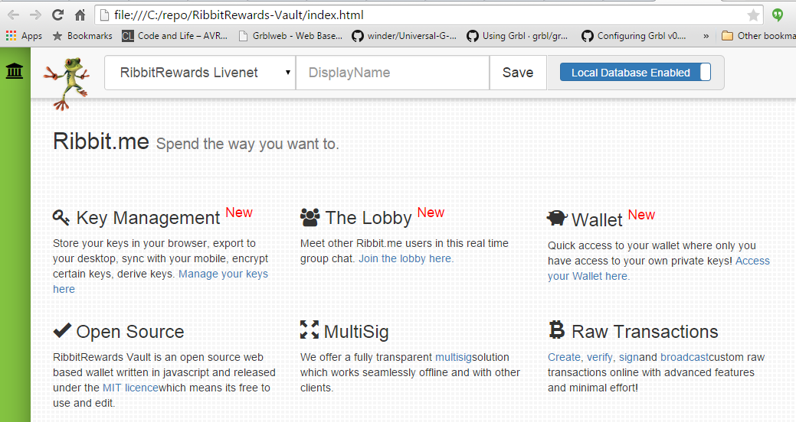
Throughout the development of our yet to be named wallet, we borrow concepts and improve upon designs such as Copay and other popular wallets. One of the features that has proven both convenient and a major pain is the option to store data on the user's browser. This is commonly known as browser storage or localstorage. One of the lessons learned from using the Copay wallet was that not everyone understans the implications of utilizing localstorage.

Local browser storage is **erased when a user chooses to clear their browser cache / history** and the most common problem we noticed was **Incognito and Private Browsing** mode does not save the localstorage once you close your browser. 

On the other hand. Local browserstorage has some amazing uses as well. The main being that its use removes the need to store any sensitive information on someone elses servers. 

---

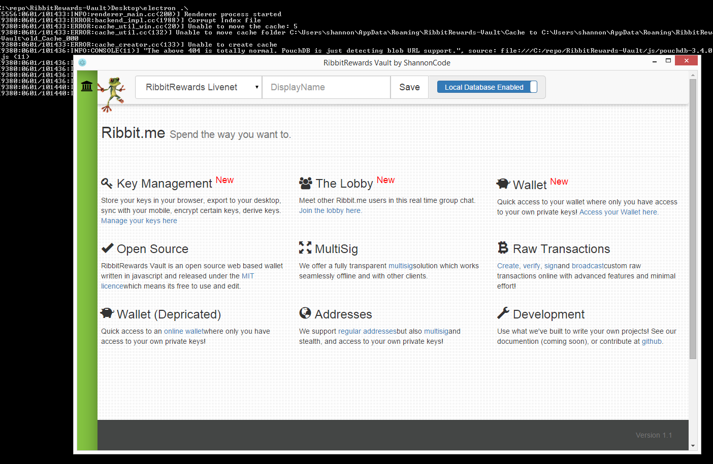 Keeping in mind problems users have had with previous wallets we decided to focus on ways to mitigate the loss of data. One of those is having a dedicated browser instance dedicated to only the wallet. We are utilizing the [Electron](http://electron.atom.io/) project to achieve this. What electron is, is a slimmed down version of Chromium for Windows, Linux and Mac. The majority of the junk is removed and the ability to run nodejs locally was added. Electron used to be called Atom shell and is used in the Slack desktop client, Microsoft Code IDE, and many others. Included in our repo is a batch file that will launch the win32 version of the wallet wrapped up into the electron shell. 
   *You can alternatively open the index.html file in your favorite web browser.*

	
---

### Key Management
#### We wanted our wallet to have the granularity to allow for advanced management of private and public keys.

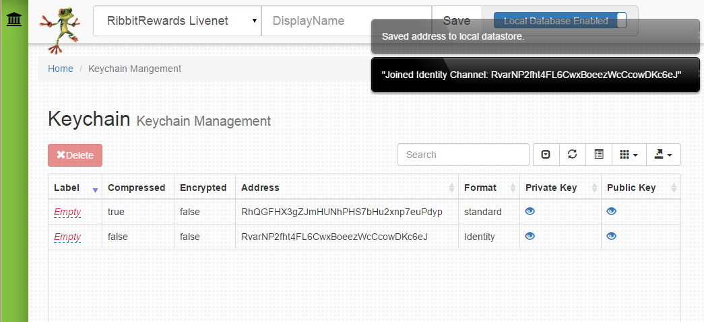
Your keys of all type are maintained on the management page. The actual key data is hidden from immediate view. If you chose to protect the key using a seperate layer of encryption, you will be required to enter the decryption password in order to sign transactions or export the key data.

Currently we support. HD Keys, Brain wallets, standard compressed, uncompressed and extended keys and aes encrypted key data.

#### Keys are ugly to read.
Labling keys is currently the way to set one apart from each other. You will eventually store other people's pubkeys and associated addresses in the same datastore and will want to be able to tag these identity addresses and tell one from the other as well.  
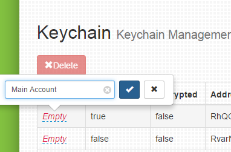
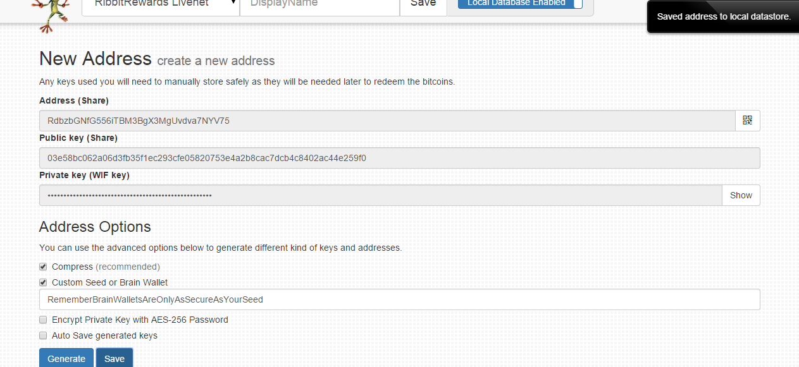

##### Multisig

Multi-signature address creation is complete. The saving into the datastore and address management has not been integrated.
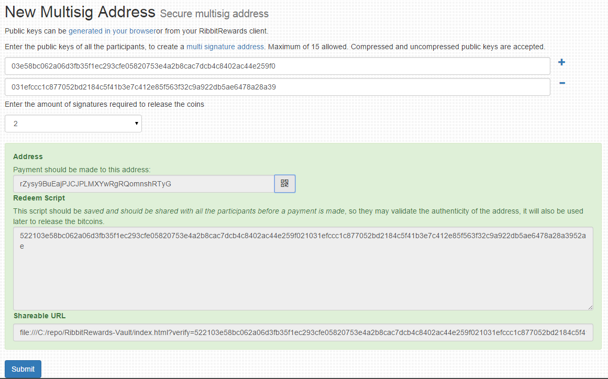

###### Multisig is currently under construction and should not be used on a large qty of coins. (alpha)
enter a few pubkeys and you can generate keys that require multiple signatures. 

---

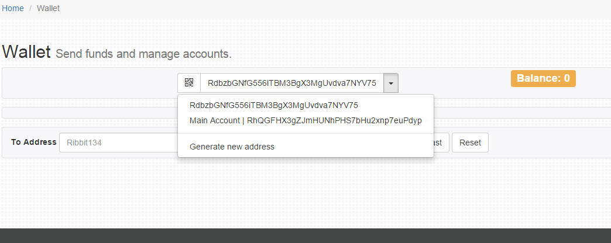
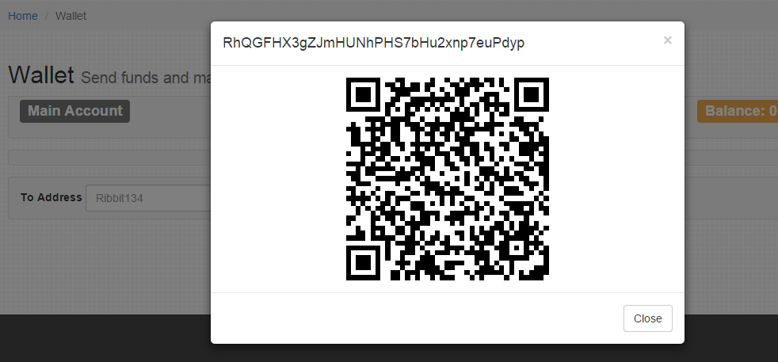

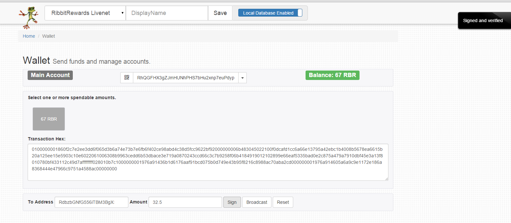
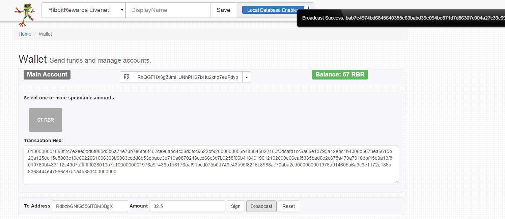
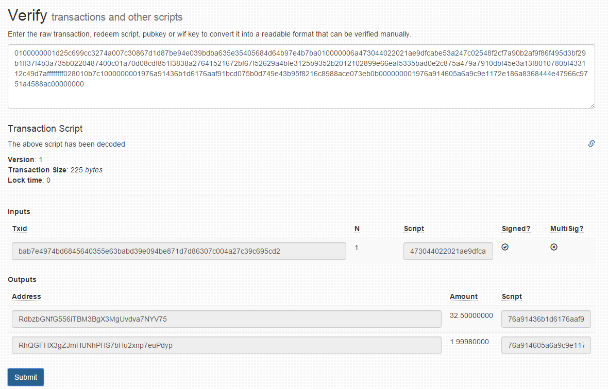
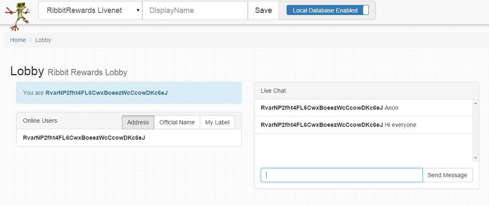
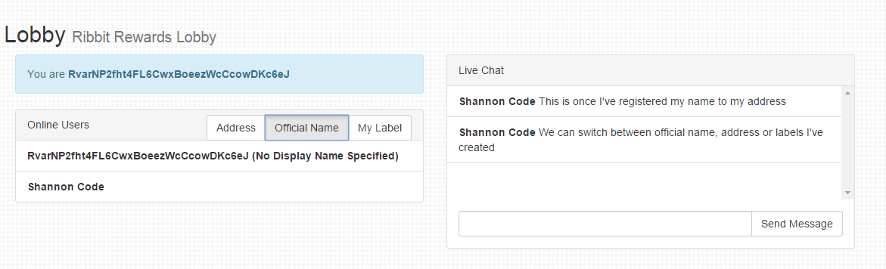
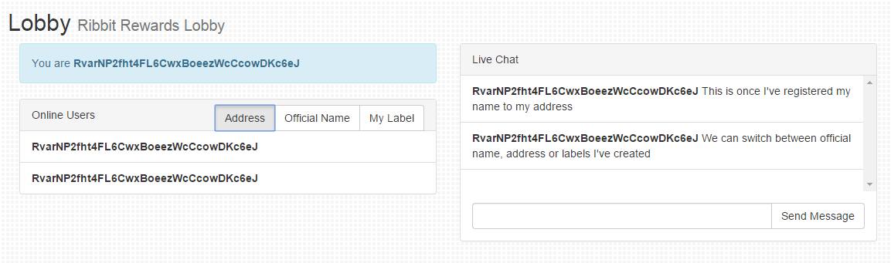

